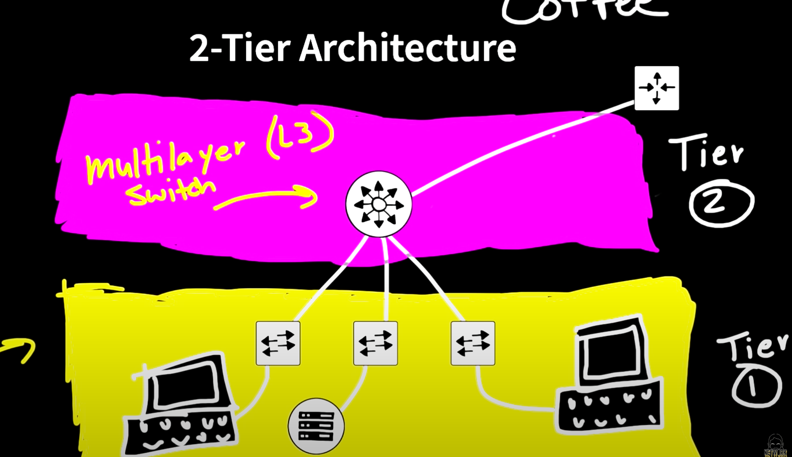
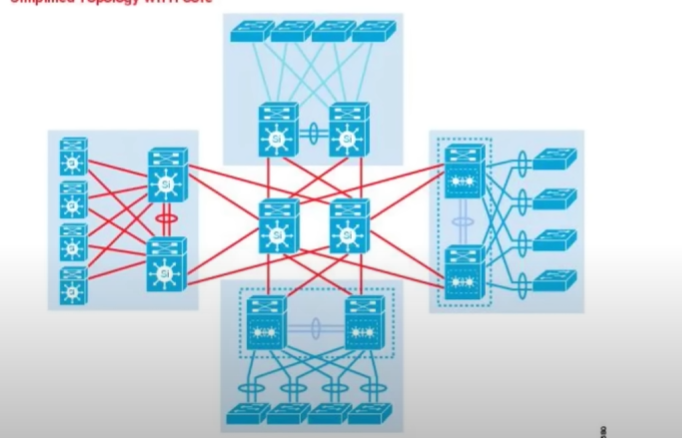

# Networking

A network i a group of connected computers that are able to send data to each other. 

The internet is a vast collection of networks that connect to each other.

## Table of content
1. [Distributed Networking](#distributed-networking)
2. [How does the internet work?](#how-does-the-internet-work)
3. [Switch](#switch)
4. [Routers](#routers)
5. [Keywords](#keywords)

## Distributed Networking
There is no control center for the internet, it isn't dependent on any individual machine. Any computer or hardware that can send and receive data in the correct fashion can be part of the internet.

## How does the internet work?

After creating the first network, a group of people developed a unified networking model, so each computer could send files to other computers:

### TCP/IP
#### Layers (from bottom to top)
Even if the OSI model lost the war between 

`L1 Physical Layer`: PDU (Protocol Data Unit) lvl 1, called bits 
- All the physical stuff. 
- Hubs also can be part of it
- Repeaters

`L2 Data Link Layer`: PDU (Protocol Data Unit) lvl 2, called Frame 
- MAC Address

`L3 Network Layer`: PDU (Protocol Data Unit) lvl 3, called packet 
- Takes a segment and turn it into a packet
- IP Address

`L4 Transport Layer`: PDU (Protocol Data Unit) lvl 4, called segment 
- Takes data from the session layer and encapsulates it into a segment (in TCP) or datagram (UDP)
- Protocols (some of them):
    - TCP (Transmission Control Protocol)
    - UDP (User Datagram Protocol)

`L7 Application Layer`: PDU (Protocol Data Unit) lvl 5, called Data 
- Protocols (some of them):
    - HTTP / HTTPS
    - SMTP
    - DNS
    - IMAP / POP3

### OSI
#### Layers (from bottom to top)

Even if the OSI model lost the war against TCP/IP, people kept calling L7 to the aplication layer even if the TCP/IP have 5

`L1 Physical Layer`: PDU (Protocol Data Unit) lvl 1, called bits 
- All the physical stuff. 
- Hubs also can be part of it
- Repeaters

`L2 Data Link Layer`: PDU (Protocol Data Unit) lvl 2, called Frame 
- MAC Address

`L3 Network Layer`: PDU (Protocol Data Unit) lvl 3, called packet 
- Takes a segment and turn it into a packet
- IP Address

`L4 Transport Layer`: PDU (Protocol Data Unit) lvl 4, called segment 
- Takes data from the session layer and encapsulates it into a segment (in TCP) or datagram (UDP)

`L5 Session Layer`

`L6 Presentation Layer`

`L7 Application Layer`

### Encapsulation

Every layer, it will give a header. From L7 to L1

App (Data) -> L5 (H5 + Data) -> L4 (H4 + H5 + Data) -> L3 (H3 + H4 +H5 + Data) -> L2 (H2 + H3 + H4 + H5 + Data) -> L1 (H1 + H2 + H3 + H4 + H5 + Data)

`Note`: H means header

### De-encapsulation

Every layer, it will remove a header. From L1 to L7

L1 (H1 + H2 + H3 + H4 + H5 + Data) -> L2 (H2 + H3 + H4 + H5 + Data) -> L3 (H3 + H4 + H5 + Data) -> L4 (H4 + H5 + Data) -> L5 (H5 + Data) -> App (Data)

There are 2 main concepts:
### Packets
Is a small segment of a larger message. Each packet contains both data and info about that data. The information about the packet's contents is known as the "header"and it goes at the front of the packet so that receiven machine knows what to do with the packet. 

When data gets sent over the internet, it is first broken up into smaller packets, which are then translated into bits. The packets get routed to their destination by various networkind devices such as routers and switches. When the packets arrive at their destination, the receiving device reassembles the packets in order and can then use or display the data.

Packets are sent across the internet using a technique called packet switching.

### Protocols
Connecting two computers, both of which may use different hardware and run different software, is one of the main challenges that the creators of the internet had to solve.

This problem is solved with standardized protocols. In networking, a protocol is a standardized way of doing certain actions and formatting data so that two or more devices are able to communicate with and understand each other.

There are protocols for sending packts between devices on the same network (Ethernet), for sending packets from network to network (IP), for ensuring those packets successfully arrive in order (TCP), and for formatting data for websites and apps (HTTP). In addition, there are also protocols for routing, testind and ecryption, also there are alternatives to the protocoles listed above, like UDP instead of TCP

## Switch

a network switch connects devices within a single network and forwards data packets to and from those devices. A switch only sends data to the single device it is intended for 

### Types of switch

`Layer 2 switch (data link layer)`

- Switches forward data based on the destination MAC address

`Layer 3 switch (network layer)`

- Switches forward data bases on the destination IP address 

some switches can do both

## Routers
Forward packets to different computer networks based on their destination. Routers make sure that internet traffic goes to the right networks

## Keywords

## Network design

- don't have a SPOF (Single point of failure)

### 2-tier Architecture

### 3-tier Architecuture

